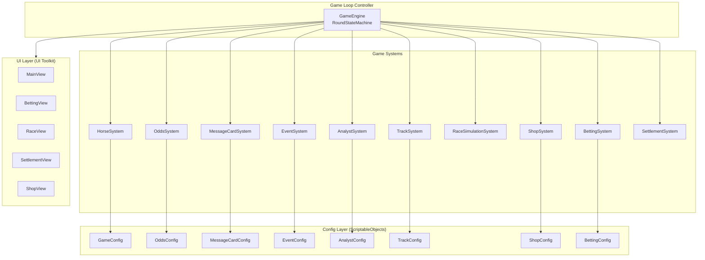
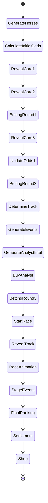

# Design Document: Horse Betting Simulator

## Overview

賽馬投注模擬器是一款 Unity 單機策略遊戲。玩家在每場比賽中透過有限的消息卡、分析師情報與賽道條件進行推理，推測八匹馬的隱藏速度加成，並在三個投注時機下注以最大化獲利。

### 設計目標

- **資料驅動**：所有遊戲數值由 ScriptableObject 管理，無硬編碼
- **模組化**：各子系統獨立封裝，透過介面溝通
- **可擴展**：支援未來新增賽道類型、事件、投注方式
- **明確的遊戲回合流程**：21 步驟固定順序執行

### 技術堆疊

- Unity 6000.4 (C# 9.0, .NET Standard 2.1)
- **2D 遊戲風格**：使用 2D Sprite 與 UI Toolkit 混合呈現
- UI Toolkit 為主要 UI 框架（HUD、投注、結算、商店畫面）
- 賽事動畫使用 2D Sprite + Unity 2D 系統（橫向卷軸視角）
- ScriptableObject 為設定資料載體
- 無後端，單機遊戲

## Architecture

### 高階架構圖



### 架構模式

採用 **Service-Oriented Architecture** 搭配 Unity 的 MonoBehaviour/ScriptableObject 模式：

1. **GameEngine (MonoBehaviour)**：作為唯一的 MonoBehaviour 入口點，持有所有系統參照，驅動回合狀態機
2. **Systems (Plain C# Classes)**：各子系統為純 C# 類別，不繼承 MonoBehaviour，接收 Config 注入
3. **Config (ScriptableObjects)**：所有可調數值封裝為 ScriptableObject assets，可於 Inspector 編輯
4. **UI (UI Toolkit + 2D Sprites)**：HUD/投注/結算/商店使用 UXML + USS 定義介面；賽事畫面使用 2D Sprite 搭配橫向卷軸動畫呈現馬匹移動

### 回合狀態機



## Components and Interfaces

### IGameSystem Interface

```csharp
public interface IGameSystem
{
    void Initialize();
    void Reset();
}
```

### HorseSystem

```csharp
public interface IHorseSystem : IGameSystem
{
    HorseData[] GenerateHorses();
    int GetHiddenBonus(int horseIndex);
}
```

**責任**：產生 8 匹馬並分配隱藏速度加成（0~7 不重複 shuffle）。

### MessageCardSystem

```csharp
public interface IMessageCardSystem : IGameSystem
{
    MessageCard RevealNextCard();
    MessageCard[] GetRevealedCards();
    int GetRemainingCardCount();
}
```

**責任**：依據 Config 將隱藏加成對應為模糊文字描述，分三輪隨機揭露。

### OddsSystem

```csharp
public interface IOddsSystem : IGameSystem
{
    float[] CalculateOdds(HorseData[] horses, int bettingRound);
    void UpdateOddsAfterBetting(int bettingRound);
}
```

**責任**：根據馬匹分數與投注階段計算動態賠率，越後期賠率越差。

### TrackSystem

```csharp
public interface ITrackSystem : IGameSystem
{
    TrackType SelectTrack();
    int GetTrackModifier(int horseIndex, TrackType track);
    TrackType CurrentTrack { get; }
}
```

**責任**：隨機選取賽道並根據馬匹偏好表計算修正值。

### AnalystSystem

```csharp
public interface IAnalystSystem : IGameSystem
{
    AnalystIntel[] GenerateIntel(HorseData[] horses);
    PurchaseResult BuyIntel(AnalystType type, int playerBalance);
}
```

**責任**：產生分析師情報（依正確率決定真偽），處理購買邏輯。

### EventSystem

```csharp
public interface IEventSystem : IGameSystem
{
    StageEventResult[] ProcessStageEvents(HorseData[] horses, int stage, ProtectionCard[] playerCards);
}
```

**責任**：逐馬判定事件觸發，計算速度修正，處理防禦卡抵消。

### RaceSimulationSystem

```csharp
public interface IRaceSimulationSystem : IGameSystem
{
    RaceResult SimulateRace(HorseData[] horses, TrackType track, EventConfig eventConfig, ProtectionCard[] playerCards);
    int[] GetFinalRanking();
}
```

**責任**：三階段執行事件判定、計算 Final_Speed、產生名次。

### BettingSystem

```csharp
public interface IBettingSystem : IGameSystem
{
    BetResult PlaceBet(Bet bet, int playerBalance);
    Bet[] GetActiveBets();
    void ClearBets();
}
```

**責任**：驗證投注合法性、扣款、管理本回合所有投注。

### ShopSystem

```csharp
public interface IShopSystem : IGameSystem
{
    ShopItem[] GetAvailableItems();
    PurchaseResult BuyProtectionCard(int itemIndex, int playerBalance, int currentCardCount);
}
```

**責任**：管理商店商品與防禦卡購買（上限 3 張）。

### SettlementSystem

```csharp
public interface ISettlementSystem : IGameSystem
{
    SettlementResult CalculateSettlement(int[] finalRanking, Bet[] activeBets, BettingConfig config);
}
```

**責任**：計算所有投注勝負與獎金。

## Data Models

### ScriptableObject Config 結構

```csharp
[CreateAssetMenu(fileName = "GameConfig", menuName = "HorseBetting/GameConfig")]
public class GameConfig : ScriptableObject
{
    public int horseCount = 8;
    public int baseSpeed = 30;
    public int startingBalance = 1000;
    public int maxProtectionCards = 3;
    public int messageCardsPerRound = 3;
}

[CreateAssetMenu(fileName = "OddsConfig", menuName = "HorseBetting/OddsConfig")]
public class OddsConfig : ScriptableObject
{
    public float baseMultiplier = 1.0f;
    public float[] rankOdds = { 1.5f, 2.0f, 3.0f, 5.0f, 8.0f, 12.0f, 20.0f, 40.0f };
    public float round2Penalty = 0.8f;  // 第二輪賠率衰減
    public float round3Penalty = 0.6f;  // 第三輪賠率衰減
}

[CreateAssetMenu(fileName = "MessageCardConfig", menuName = "HorseBetting/MessageCardConfig")]
public class MessageCardConfig : ScriptableObject
{
    public MessageCardEntry[] entries;
}

[System.Serializable]
public class MessageCardEntry
{
    public int hiddenSpeedBonus;
    public string description;  // 模糊文字描述
}

[CreateAssetMenu(fileName = "TrackConfig", menuName = "HorseBetting/TrackConfig")]
public class TrackConfig : ScriptableObject
{
    public TrackPreference[] horsePreferences;  // 8 匹馬 × 3 種賽道
}

[System.Serializable]
public class TrackPreference
{
    public int horseIndex;
    public int grassModifier;
    public int mudModifier;
    public int snowModifier;
}

[CreateAssetMenu(fileName = "AnalystConfig", menuName = "HorseBetting/AnalystConfig")]
public class AnalystConfig : ScriptableObject
{
    public int seniorPrice = 200;
    public float seniorAccuracy = 0.8f;
    public int juniorPrice = 80;
    public float juniorAccuracy = 0.5f;
}

[CreateAssetMenu(fileName = "EventConfig", menuName = "HorseBetting/EventConfig")]
public class EventConfig : ScriptableObject
{
    public RaceEvent[] events;
}

[System.Serializable]
public class RaceEvent
{
    public string eventName;
    public string description;
    public float triggerChance;  // 0.0 ~ 1.0
    public int speedModifier;   // 正值加速、負值減速
    public string targetType;   // "single", "all"
}

[CreateAssetMenu(fileName = "ShopConfig", menuName = "HorseBetting/ShopConfig")]
public class ShopConfig : ScriptableObject
{
    public ProtectionCardData[] protectionCards;
}

[System.Serializable]
public class ProtectionCardData
{
    public string cardName;
    public string protectsAgainst;  // 對應事件名稱
    public float successRate;
    public int price;
}

[CreateAssetMenu(fileName = "BettingConfig", menuName = "HorseBetting/BettingConfig")]
public class BettingConfig : ScriptableObject
{
    public BetTypeConfig[] betTypes;
}

[System.Serializable]
public class BetTypeConfig
{
    public BetType type;
    public float oddsMultiplier;
}
```

### 遊戲資料模型

```csharp
public enum TrackType { Grass, Mud, Snow }
public enum BetType { SingleWin, Place, Quinella, Exacta, Trio, Trifecta }
public enum AnalystType { Senior, Junior }

public struct HorseData
{
    public int index;           // 0~7
    public int baseSpeed;       // 固定 30
    public int hiddenBonus;     // 0~7 隨機分配
    public string displayName;  // "Horse 1" ~ "Horse 8"
}

public struct MessageCard
{
    public int horseIndex;
    public string description;  // 模糊描述
}

public struct Bet
{
    public BetType type;
    public int amount;
    public int[] selectedHorses;  // 所選馬匹索引
    public int bettingRound;      // 在第幾輪下注
    public float oddsAtBet;       // 下注時的賠率
}

public struct BetResult
{
    public bool success;
    public string errorMessage;
    public int remainingBalance;
}

public struct StageEventResult
{
    public int horseIndex;
    public string eventName;
    public int speedModifier;
    public bool wasProtected;  // 是否被防禦卡抵消
}

public struct RaceResult
{
    public int[] finalRanking;           // 名次排序 (horseIndex)
    public int[] finalSpeeds;            // 每匹馬最終速度
    public StageEventResult[][] stageEvents;  // 三階段事件結果
}

public struct SettlementResult
{
    public BetSettlement[] betResults;
    public int totalWinnings;
    public int totalLoss;
    public int netProfit;
}

public struct BetSettlement
{
    public Bet bet;
    public bool won;
    public int payout;
}

public struct AnalystIntel
{
    public AnalystType type;
    public string content;
    public bool isAccurate;  // 對玩家隱藏
    public int price;
}

public struct PurchaseResult
{
    public bool success;
    public string errorMessage;
    public int remainingBalance;
}

public struct ProtectionCard
{
    public string cardName;
    public string protectsAgainst;
    public float successRate;
}

public struct ShopItem
{
    public ProtectionCardData data;
    public bool canAfford;
}
```

## Correctness Properties

*A property is a characteristic or behavior that should hold true across all valid executions of a system — essentially, a formal statement about what the system should do. Properties serve as the bridge between human-readable specifications and machine-verifiable correctness guarantees.*

### Property 1: Horse Generation Invariant

*For any* random seed, generating horses SHALL produce exactly 8 horses, each with base speed 30, and the set of Hidden_Speed_Bonus values SHALL form a permutation of {0, 1, 2, 3, 4, 5, 6, 7} — no duplicates, no missing values.

**Validates: Requirements 2.1, 2.2, 2.3**

### Property 2: Message Card Reveal Uniqueness

*For any* round of message card reveals, the 3 revealed cards SHALL all be distinct, each belonging to the original set of 8 cards, and no card SHALL appear more than once across the 3 reveals.

**Validates: Requirements 3.2, 3.3, 3.4, 3.5**

### Property 3: Message Card Config Mapping

*For any* horse with Hidden_Speed_Bonus value B and a valid MessageCardConfig, the generated Message_Card description SHALL equal the config entry mapped to bonus value B.

**Validates: Requirements 3.1**

### Property 4: Odds Strength Ordering

*For any* set of 8 horses with distinct Final_Scores, the initial odds SHALL be ordered such that the horse with the highest Final_Score has the lowest odds (shortest payout) and the horse with the lowest Final_Score has the highest odds.

**Validates: Requirements 4.1**

### Property 5: Odds Monotonic Degradation

*For any* horse across betting rounds, the odds at round N+1 SHALL be strictly less favorable (lower multiplier) than the odds at round N. Specifically: odds(round3) < odds(round2) < odds(round1).

**Validates: Requirements 4.3, 4.4, 4.5**

### Property 6: Track Modifier Config Lookup

*For any* valid (horseIndex, trackType) pair, GetTrackModifier SHALL return the exact value defined in the TrackConfig for that horse-track combination.

**Validates: Requirements 5.5**

### Property 7: Analyst Pricing Hierarchy

*For any* valid AnalystConfig, the Senior Analyst price SHALL be strictly greater than the Junior Analyst price, AND the Senior Analyst accuracy SHALL be strictly greater than the Junior Analyst accuracy.

**Validates: Requirements 6.2, 6.3**

### Property 8: Purchase Balance Deduction

*For any* purchase (analyst intel or shop item) where player balance >= price, the purchase SHALL succeed and the resulting balance SHALL equal (original balance - price). For any purchase where balance < price, the purchase SHALL fail and balance SHALL remain unchanged.

**Validates: Requirements 6.5, 6.7, 10.5, 10.6**

### Property 9: Event Application Correctness

*For any* triggered event with a defined speedModifier, the modifier applied to the target horse SHALL equal exactly the event's configured speedModifier value. If a matching Protection_Card with successRate 1.0 is held, the event SHALL be fully cancelled (modifier = 0).

**Validates: Requirements 7.3, 7.5**

### Property 10: Final Speed Formula

*For any* horse with known (baseSpeed, hiddenBonus, trackModifier, stage1Modifier, stage2Modifier, stage3Modifier), the computed Final_Speed SHALL equal baseSpeed + hiddenBonus + trackModifier + stage1Modifier + stage2Modifier + stage3Modifier.

**Validates: Requirements 8.3**

### Property 11: Ranking Correctness

*For any* set of 8 horses with computed Final_Speeds, the final ranking SHALL be sorted by Final_Speed descending, and when two or more horses share the same Final_Speed, the horse with the lower index SHALL rank higher. The ranking SHALL contain all 8 horses with no duplicates.

**Validates: Requirements 8.4, 8.5, 11.5**

### Property 12: Bet Validation

*For any* bet with amount A and player balance B: if A ≤ B the bet SHALL be accepted and new balance = B - A; if A > B the bet SHALL be rejected and balance remains B.

**Validates: Requirements 9.3, 9.4, 9.6**

### Property 13: Protection Card Limit

*For any* player holding exactly 3 Protection_Cards, any subsequent purchase attempt SHALL be rejected regardless of balance. For any player holding fewer than 3 cards with sufficient balance, the purchase SHALL succeed and card count SHALL increase by 1.

**Validates: Requirements 10.3, 10.4, 10.6**

### Property 14: Settlement Arithmetic

*For any* set of bets and a final ranking, each bet SHALL be evaluated against the ranking, winning bets SHALL receive payout = betAmount × oddsMultiplier, and the net profit SHALL equal (sum of all payouts) - (sum of all bet amounts placed this round).

**Validates: Requirements 11.3, 11.4, 11.6, 11.7**

### Property 15: Bet Type Win Conditions

*For any* final ranking and bet:
- SingleWin: wins iff selectedHorse[0] == ranking[0]
- Place: wins iff selectedHorse[0] ∈ ranking[0..2]
- Quinella: wins iff {selectedHorses} == {ranking[0], ranking[1]} (order irrelevant)
- Exacta: wins iff selectedHorses[0] == ranking[0] AND selectedHorses[1] == ranking[1]
- Trio: wins iff {selectedHorses} == {ranking[0], ranking[1], ranking[2]} (order irrelevant)
- Trifecta: wins iff selectedHorses[i] == ranking[i] for i = 0,1,2

**Validates: Requirements 9.1, 11.3**

## Error Handling

### Config Validation Errors

| Error Condition | Handling Strategy |
|---|---|
| Missing config file | Log error, fall back to hardcoded defaults, show warning to developer |
| Invalid config values (negative prices, accuracy > 1.0) | Clamp to valid ranges, log warning |
| Incomplete message card mapping (< 8 entries) | Reject config, display error in console |
| Event with triggerChance outside [0,1] | Clamp to [0,1], log warning |

### Runtime Errors

| Error Condition | Handling Strategy |
|---|---|
| Player attempts bet with amount ≤ 0 | Reject bet, show validation message |
| Player attempts bet on invalid horse index | Reject bet, log error |
| Insufficient balance for any purchase | Block action, show insufficient funds UI |
| Protection card limit exceeded | Block purchase, show limit reached UI |

### State Machine Errors

| Error Condition | Handling Strategy |
|---|---|
| Step called out of order | Assert in debug mode, log error and force correct step in release |
| System returns unexpected null | Use NullObject pattern with safe defaults, log warning |

## Testing Strategy

### Unit Tests (Example-Based)

Unit tests cover specific scenarios, edge cases, and integration points:

- **State machine**: Verify 21-step sequence executes in correct order
- **Config loading**: Verify ScriptableObjects are loaded correctly
- **UI data binding**: Verify view models contain expected data
- **Edge cases**: Empty bets, zero balance, max card count boundary

### Property-Based Tests (Universal Properties)

Property-based testing is appropriate for this feature because the core game logic consists of pure functions with clear input/output behavior: random allocation, arithmetic formulas, sorting, validation rules, and settlement calculations.

**Library**: [FsCheck](https://github.com/fscheck/FsCheck) for C# (NuGet: FsCheck, FsCheck.NUnit)

**Configuration**:
- Minimum 100 iterations per property test
- Each test tagged with: `Feature: horse-betting-simulator, Property {N}: {title}`
- Tests run via NUnit test runner in Unity Test Framework (Edit Mode tests)

**Property tests to implement** (1 test per correctness property above):

| Property | Key Generator Strategy |
|---|---|
| P1: Horse Generation | Random seeds |
| P2: Card Reveal Uniqueness | Random 8-card sets, random reveal sequences |
| P3: Config Mapping | Random bonus values (0-7), random config entries |
| P4: Odds Strength Ordering | Random permutations of bonuses |
| P5: Odds Degradation | Random horse sets, iterate rounds |
| P6: Track Modifier Lookup | Random (horseIndex 0-7, TrackType) pairs |
| P7: Analyst Hierarchy | Random valid AnalystConfig instances |
| P8: Purchase Balance | Random (balance, price) pairs |
| P9: Event Application | Random events with known modifiers, random protection cards |
| P10: Final Speed Formula | Random (base, bonus, trackMod, e1, e2, e3) tuples |
| P11: Ranking Correctness | Random 8-element speed arrays with potential ties |
| P12: Bet Validation | Random (amount, balance) pairs |
| P13: Card Limit | Random card counts (0-4), random balances |
| P14: Settlement Arithmetic | Random bet arrays, random rankings |
| P15: Bet Type Win Conditions | Random rankings, random bet configurations |

### Integration Tests

- Full round flow: Execute one complete 21-step round and verify state consistency
- Config hot-reload: Modify config between rounds, verify new values apply
- Multi-round: Run 3+ rounds, verify balance carries over correctly

### Test Organization

```
Assets/
  Tests/
    EditMode/
      HorseSystemTests.cs
      MessageCardSystemTests.cs
      OddsSystemTests.cs
      TrackSystemTests.cs
      AnalystSystemTests.cs
      EventSystemTests.cs
      RaceSimulationTests.cs
      BettingSystemTests.cs
      ShopSystemTests.cs
      SettlementSystemTests.cs
      Properties/
        HorseGenerationProperties.cs
        MessageCardProperties.cs
        OddsProperties.cs
        RaceSimulationProperties.cs
        BettingProperties.cs
        SettlementProperties.cs
    PlayMode/
      RoundFlowIntegrationTests.cs
      UIIntegrationTests.cs
```

